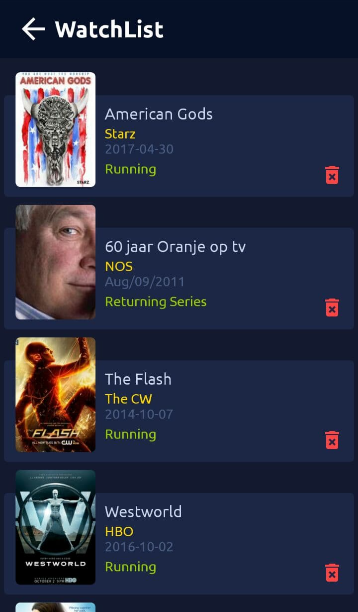
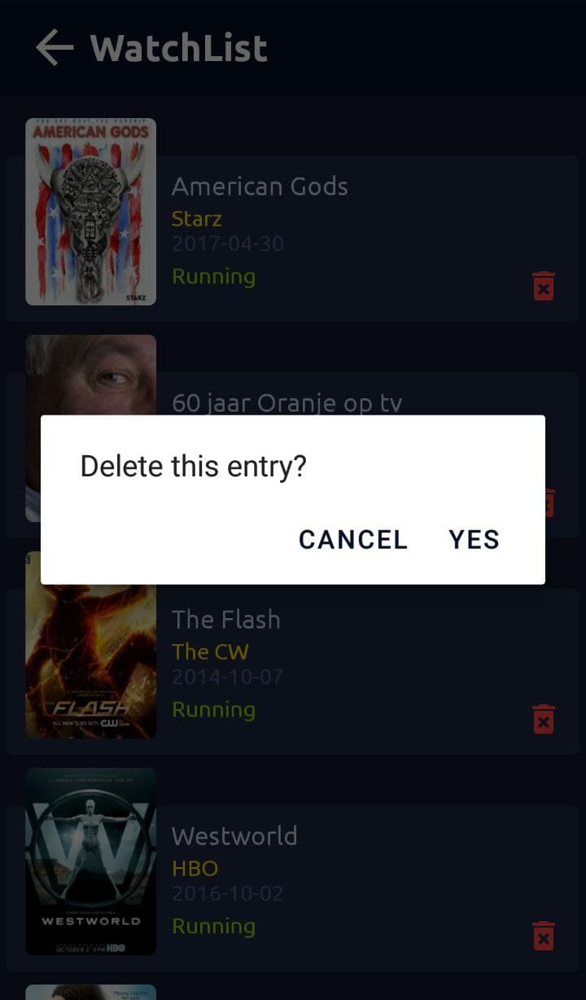
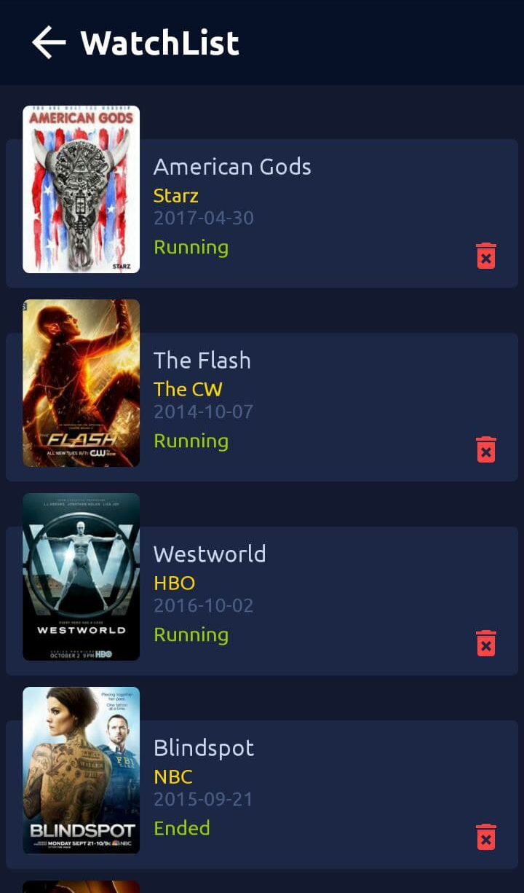

# MovieApp-Rest-api-MVVM-Room-RXJava-
The application was created for acquaintance with technologies Rest-api and a more detailed understanding of working with MVVM.

The application receives information from the site [https://www.episodate.com/](https://www.episodate.com/). Using Rest-api technology.
***
1. The main activity of the application looks like this:
  
2. Detailed information about the film:
  
3. The user can add the movie to his watchlist. And get a notification from the app about it.
  
4. The user can use the search in the application to find his favorite movie:
  
5. This is what the watchlist looks like with the user's added films: 
   
6. He can also remove a movie from his list by clicking on the delete icon:  
  
  
